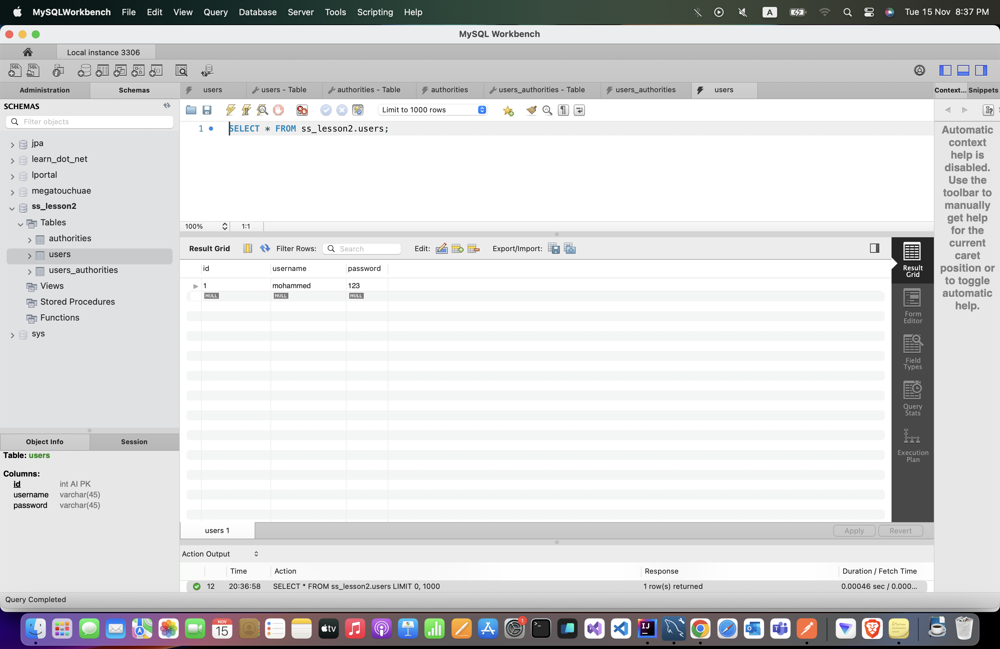
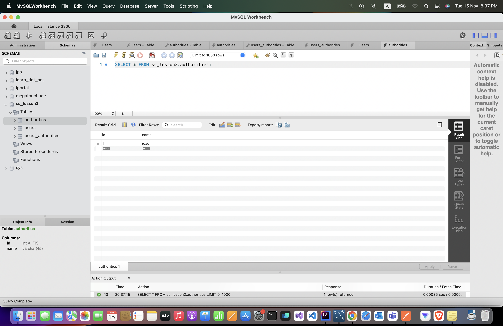
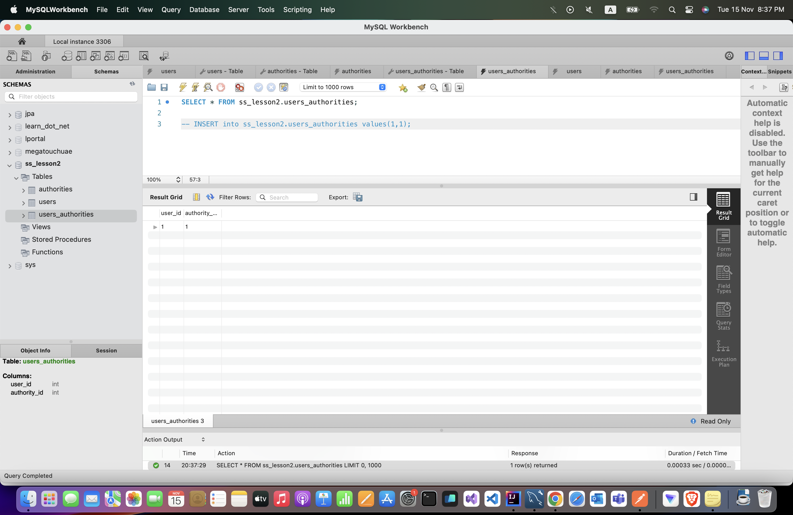
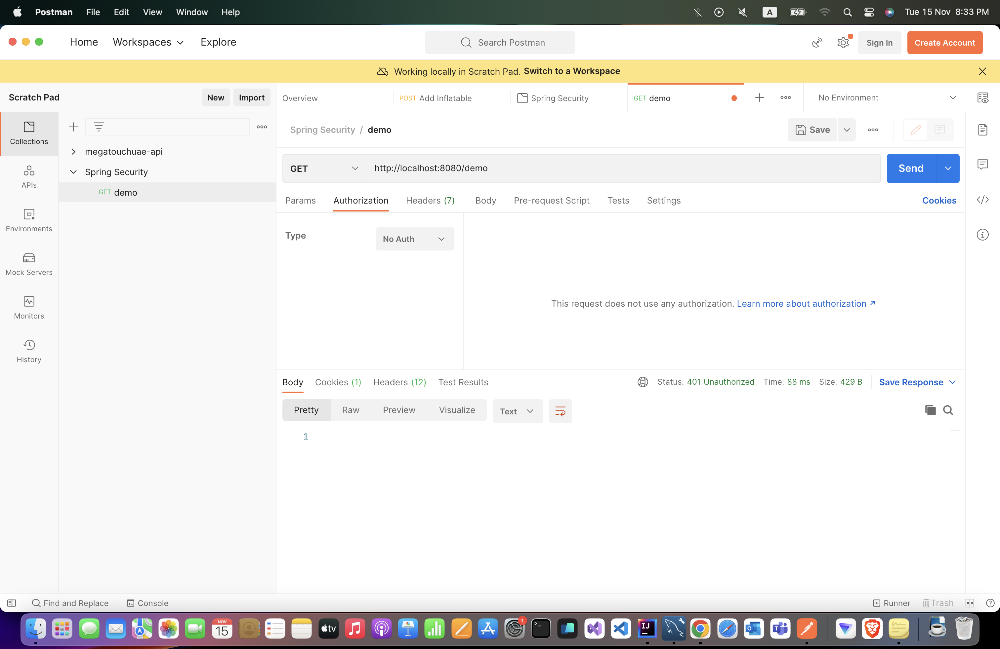
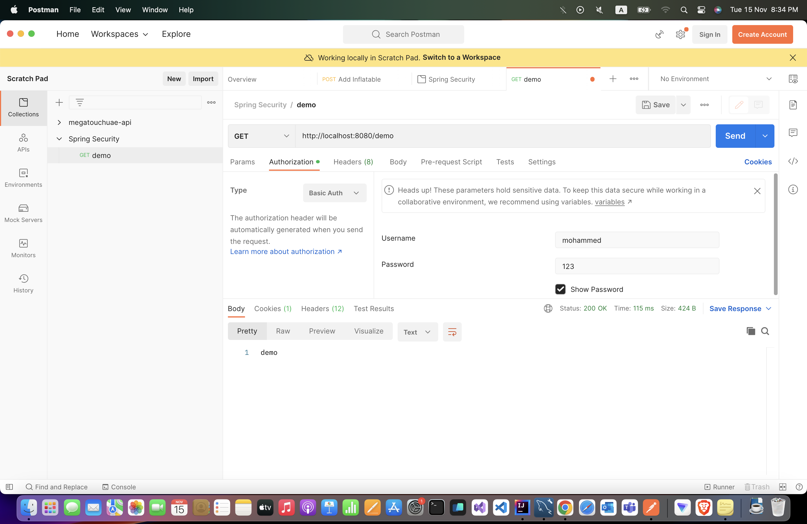

# Spring Security Fundamentals - Lesson 2 - Managing users
###### following [Spring Security Fundamentals 2022 from Laur Spilca](https://www.youtube.com/playlist?list=PLEocw3gLFc8X_a8hGWGaBnSkPFJmbb8QP "Spring Security Fundamentals 2022 Laur Spilca")

## UserDetailsService

UserDetailsService is an interface, a contract between spring security and your application, through which spring security knows how to obtain the UserDetails

## The Authentication Flow:
Spring security starts in a web application from the filters

http request comes in to the `authentication filter` the `authentication filter`  delegates to the `authentication manager` , and then the `authentication manager` finds an appropriate `authentication provider`, `authentication provider ` will search and use `UserDetailsService` and `PasswordEncoder` to get the `UserDetails` and validate the password and if the credentials are correct, the request goes all the way back to the filter and it stores an `authentication object` in a `security context` 

We will make our own `UserDetailsService` and use a database to store the users

## After Creating each table I inserted a row to use later
Creating one user:

Creating one Authority:

We will find later we have Many-To-Many relationship between User and Authority: 


## Granted Authorities
Granted Authorities can be represented either as:

- Authorities
- Roles

It’s only a conceptual difference between what authorities mean and what roles mean, but behind the scenes GrantedAuthorties is the only interface that’s used to implement either authorities or roles
From a conceptual perspective
- Authority: is an action, a user can do an action in the application like (read, write, delete, execute) it usually represented by verb
- Role: is a badge, it's usually represented by a subject like (ADMIN, MANAGER, CLIENT, VISITOR)


### Authorities table and Authority Entity
#### Authorities table
```sql
CREATE TABLE `authorities` (
  `id` int NOT NULL AUTO_INCREMENT,
  `name` varchar(45) DEFAULT NULL,
  PRIMARY KEY (`id`)
);
```

#### Authority Entity

```java
@Entity
@Table(name = "authorities")
@Getter
@Setter
public class Authority {

    @Id
    @GeneratedValue(strategy = GenerationType.IDENTITY)
    private Integer id;

    private String name;

    @ManyToMany(mappedBy = "authorities")
    private Set<User> users;

    @Override
    public String toString() {
        return "Authority{" +
                "id=" + id +
                ", name='" + name + '\'' +
                '}';
    }
}
```

#### SecurityAuthority
Although we could use `Authority Entity` to implements `GrantedAuthority` interface, but for satisfying single responsibility principle, we will use another class to represent the `GrantedAuthority` interface, we will use Adapter design pattern here.

As you see in the following snippet, it works as a wrapper.
```java
@AllArgsConstructor
public class SecurityAuthority implements GrantedAuthority {

    private final Authority authority;

    @Override
    public String getAuthority() {
        return authority.getName();
    }
}
```

## Users and Authorities
Users and Authorities have Many-To-Many relationship, so we need a table in the database to represent this relationship
```sql
CREATE TABLE `users_authorities` (
  `user_id` int DEFAULT NULL,
  `authority_id` int DEFAULT NULL
);
```

When you have a user and authorities we should have @ManyToMany relationship and the user will be the owner of this relationship and it must specify the lazy as EAGER otherwise we will get an Exception.


### Users table and User Entity

#### Users table
In reality, we don’t ever store passwords as plain text, but this is only to focus on
the topic we are learning.
```sql
CREATE TABLE `users` (
  `id` int NOT NULL AUTO_INCREMENT,
  `username` varchar(45) DEFAULT NULL,
  `password` varchar(45) DEFAULT NULL,
  PRIMARY KEY (`id`)
);
```

#### User Entity
users will have Many-To-Many relationship with Authority

we just override toString() for demonstration purpose
```java
@Entity
@Table(name = "users")
@Getter
@Setter
public class User {
    @Id
    @GeneratedValue(strategy = GenerationType.IDENTITY)
    private Integer id;

    private String username;

    private String password;

    @ManyToMany(fetch = FetchType.EAGER)
    @JoinTable(
            name = "users_authorities",
            joinColumns = @JoinColumn(name = "user_id"),
            inverseJoinColumns = @JoinColumn(name = "authority_id")
    )
    private Set<Authority> authorities;

    @Override
    public String toString() {
        return "User{" +
                "id=" + id +
                ", username='" + username + '\'' +
                ", password='" + password + '\'' +
                ", authorities=" + authorities +
                '}';
    }
}
```

#### SecurityUser
As we know, the `AuthenticationProvider` use both `UserDetailsService` and `PasswordEncoder`,loadUserByUsername in UserDetailsService needs to return UserDetails not the User Entity we created

Although we could use `User Entity` to implements `UserDetails` interface, but for satisfying single responsibility principle, we will use another class to represent the `UserDetails` interface, we will use Adapter design pattern here.

As you see in the following snippet, it works as a wrapper. 
```java
@AllArgsConstructor
public class SecurityUser implements UserDetails {

    private final User user;

    @Override
    public String getUsername() {
        return user.getUsername();
    }

    @Override
    public String getPassword() {
        return user.getPassword();
    }

    @Override
    public Collection<? extends GrantedAuthority> getAuthorities() {
        return user
                .getAuthorities()
                .stream()
                .map(SecurityAuthority::new)
                .collect(Collectors.toList());
    }

    @Override
    public boolean isAccountNonExpired() {
        return true;
    }

    @Override
    public boolean isAccountNonLocked() {
        return true;
    }

    @Override
    public boolean isCredentialsNonExpired() {
        return true;
    }

    @Override
    public boolean isEnabled() {
        return true;
    }

    @Override
    public String toString() {
        return "SecurityUser{" +
                "user=" + user +
                '}';
    }
}
```

## UserRepository
`UserDetailsService` needs to find a user using username, so:
```java
public interface UserRepository extends JpaRepository<User, Integer> {

    @Query("""
            SELECT u FROM User u WHERE u.username = :username
            """)
    Optional<User> findUserByUsername(String username);
}

```

## UserDetailsService and PasswordEncoder
### Our Own UserDetailsService
```java
@Service
@AllArgsConstructor
public class JpaUserDetailsService implements UserDetailsService {

    private final UserRepository userRepository;

    @Override
    public UserDetails loadUserByUsername(String username) throws UsernameNotFoundException {
        Optional<User> user = userRepository.findUserByUsername(username);

        System.out.println(user.map(SecurityUser::new));

        return user.map(SecurityUser::new)
                .orElseThrow(() -> new UsernameNotFoundException("Username not found " + username ));
    }
}
```
### PasswordEncoder
```java
@Configuration
public class SecurityConfig {

    @Bean
    public PasswordEncoder passwordEncoder() {
        return NoOpPasswordEncoder.getInstance();
    }

}
```

## DemoController
```java
@RestController
public class DemoController {

    @GetMapping("/demo")
    public ResponseEntity<String> demo() {
        return ResponseEntity.ok("demo");
    }
}
```

### Using Postman:

#### Without using credentials:


#### With using credentials:



