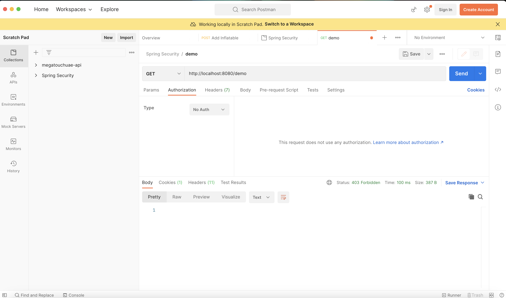
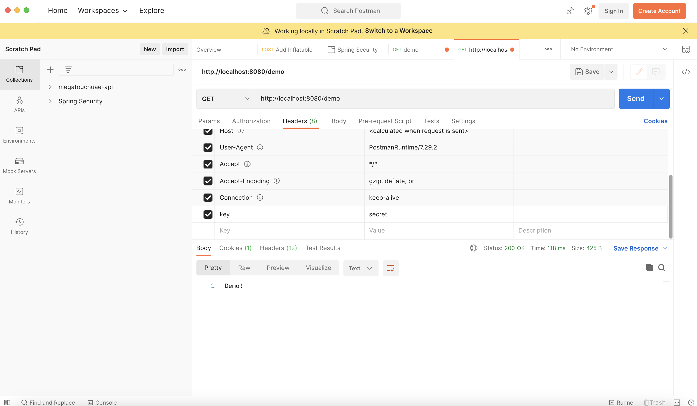

# Spring Security Fundamentals - Lesson 3 - Custom authentication
###### following [Spring Security Fundamentals 2022 from Laur Spilca](https://www.youtube.com/playlist?list=PLEocw3gLFc8X_a8hGWGaBnSkPFJmbb8QP "Spring Security Fundamentals 2022 Laur Spilca")


## Custom Authentication
In real life we will not often implement custom authentication mechanism from filters to the provider, but it gives us perspective about the entire design behind the scenes.

Actually the authentication mechanism we are going to implement here is not used anywhere it's just for demonstrating purposes.

## The Big Picture:
1. Create A Custom Filter
2. Create an authentication object which is not yet authenticated **(we will use our own Custom Authentication object that implements `Authentication` interface from Spring Security)**
3. Delegates the authentication object to the manager **(we will use our own Custom Authentication Manager  that implements `AuthenticationManager` interface from Spring Security, and this custom authentication manager will use custom authentication provider that implements `AuthenticationProvider`)**
4. Get back the authentication from the manager
5. if the object is not authenticated then send request back to the next filter in the chain

### 1. Create A Custom Filter
CustomAuthenticationFilter implements `Filter `
When you implement Filter interface, there is no guarantee that the filter will be called once, in the filter chain there is no guarantee that the filter will be called once. If you would really want to make sure that the filter is only called once extends `OncePerRequestFilter` , in `OncePerRequestFilter` we need to propagate  to the next filter in the filter chain, but we need to do this only when authentication worked.

```java
// CustomAuthenticationFilter.java
@Component
public class CustomAuthenticationFilter extends OncePerRequestFilter {

    @Override
    protected void doFilterInternal(
            HttpServletRequest request,
            HttpServletResponse response,
            FilterChain filterChain) throws ServletException, IOException {
        // 1. create an authentication object which is not yet authenticated
        // 2. delegate the authentication object to the manager
        // 3. get back the authentication from the manager
        // 4. if the object is authenticated then send request to the next filter in the chain

        filterChain.doFilter(request, response);
    }
}
```
We created a Filter bean, but as you see we need also to implement `Authentication`, `AuthenticationManager` and `AuthenticationProvider` interfaces.


### 2. Create Custom Authentication
As we discussed we need to implement the `Authentication` interface
```java
@AllArgsConstructor
@Getter
public class CustomAuthentication implements Authentication {

    private final boolean authentication;
    private final String key;

    @Override
    public boolean isAuthenticated() {
        return authentication;
    }

    @Override
    public Collection<? extends GrantedAuthority> getAuthorities() {
        return null;
    }

    @Override
    public Object getCredentials() {
        return null;
    }

    @Override
    public Object getDetails() {
        return null;
    }

    @Override
    public Object getPrincipal() {
        return null;
    }

    @Override
    public void setAuthenticated(boolean isAuthenticated) throws IllegalArgumentException {

    }

    @Override
    public String getName() {
        return null;
    }

    @Override
    public boolean implies(Subject subject) {
        return Authentication.super.implies(subject);
    }
}
```

### 3. Create Custom AuthenticationManager
As we discussed we need to implement the `AuthenticationManager` interface

The role of the Authentication Manager is delegating to a Authentication provider, if you have just one Authentication Provider, you may get rid of Authentication Provider and implement the logic in Authentication Manager, but the spring security design allows you easily to have multiple authentication logic through having multiple providers. So it’s a good practice to have a provider even if you have only one authentication logic.
```java
// CustomAuthenticationManager.java
@Component
@AllArgsConstructor
public class CustomAuthenticationManager implements AuthenticationManager {

    private final CustomAuthenticationProvider provider;

    @Override
    public Authentication authenticate(Authentication authentication) throws AuthenticationException {
        if (provider.supports(authentication.getClass())) {
            return provider.authenticate(authentication);
        }

        throw new BadCredentialsException("Oh No!");
    }
}
```
How does the Authentication Manager knows that the specific provider is the one to be used?
* to do that we need to implement the supports method from  AuthenticationProvider interface

### 4. Create Custom AuthenticationProvider
As we discussed, we need to implement `AuthenticationProvider`, the  `authenticate` method as the name suggests, it has the authentication logic, and the `supports` will be used by `AuthenticationManager` to know whether this is the appropriate provider or not.

###### the Key
```properties
# application.properties
our.very.very.secret.key=secret
```

```java
@Component
public class CustomAuthenticationProvider implements AuthenticationProvider {
    @Value("${our.very.very.secret.key}")
    private String key;

    @Override
    public Authentication authenticate(Authentication authentication) throws AuthenticationException {
        CustomAuthentication ca = (CustomAuthentication) authentication;

        String headerKey = ca.getKey();

        if (key.equals(headerKey)) {
            return new CustomAuthentication(true, null);
        }
        throw new BadCredentialsException("Oh No!");
    }

    @Override
    public boolean supports(Class<?> authentication) {
        return CustomAuthentication.class.equals(authentication);
    }
}
```

### Back to Our Custom Filter
The recipe to implement custom authentication was the following
1. Create A Custom Filter 
2. Create an authentication object which is not yet authenticated **(we will use our own Custom Authentication object that implements `Authentication` interface from Spring Security)** 
3. Delegates the authentication object to the manager **(we will use our own Custom Authentication Manager  that implements `AuthenticationManager` interface from Spring Security, and this custom authentication manager will use custom authentication provider that implements `AuthenticationProvider`)** 
4. Get back the authentication from the manager
5. if the object is not authenticated then send request back to the next filter in the chain

We created the following:
* CustomAuthentication implements `Authentication` ✅
* CustomAuthenticationManager implements `AuthenticationManager` ✅
* CustomAuthenticationProvider implements `AuthenticationProvider` ✅

Now the ingredients are ready to be used in the recipe:
```java
// CustomAuthenticationFilter.java
@Component
@AllArgsConstructor
public class CustomAuthenticationFilter extends OncePerRequestFilter {

    private final CustomAuthenticationManager manager;

    @Override
    protected void doFilterInternal(
            HttpServletRequest request,
            HttpServletResponse response,
            FilterChain filterChain) throws ServletException, IOException {
        // 1. create an authentication object which is not yet authenticated
        String key = String.valueOf(request.getHeader("key"));
        CustomAuthentication ca = new CustomAuthentication(false, key);

        // 2. delegate the authentication object to the manager
        // 3. get back the authentication from the manager
        Authentication authentication = manager.authenticate(ca);
        // 4. if the object is authenticated then send request to the next filter in the chain
        if (authentication.isAuthenticated()){
            SecurityContextHolder.getContext().setAuthentication(authentication);
            filterChain.doFilter(request, response);// only when authentication worked
        }
    }
}
```
When we add the authentication object to the security context through SecurityContextHolder the authorization mechanism can check who authenticated and based on who authenticated and their privileges they will be granted different access in the application

Now everything is set, but we need to register the filter programmatically by creating a `SecurityFilterChain` bean.
## Register the filter
To register the filter programmatically we need to create a `SecurityFilterChain` bean.
in the past, they were using ~~`WebSecurityConfigurerAdapter`~~ but it's deprecated now.
```java
@Configuration
@AllArgsConstructor
public class SecurityConfig {

    private final CustomAuthenticationFilter filter;

    @Bean
    public SecurityFilterChain securityFilterChain(HttpSecurity http) throws Exception {
        return http
                .addFilterAt(filter, UsernamePasswordAuthenticationFilter.class)
                .authorizeRequests().anyRequest().authenticated() // don't worry about this
                .and()
                .build();
    }

}
```
### What is addFilterAt()
Adds the Filter at the location of the specified Filter class. For example, if you want the filter CustomFilter to be registered in the same position as UsernamePasswordAuthenticationFilter, you can invoke:
`addFilterAt(new CustomFilter(), UsernamePasswordAuthenticationFilter.class)`

Now everything should work fine.

## Demo Contoller
```java
@RestController
public class DemoController {

    @GetMapping("demo")
    public ResponseEntity<String> demo() {
        return ResponseEntity.ok("Demo!");
    }
}
```

## Using Postman:
###### Without the Key:


###### With the Key:


